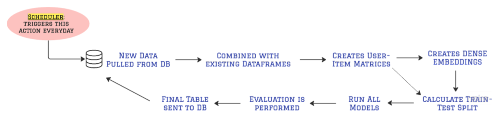

# nus_capstone_v2
This project is part of our BT4103 NUS Capstone Final Year Project, which is completed with Recce Pvt Ltd. Our project serves to address the issues by designing an interactive and visual platform to analyse and evaluate the performance of recommender systems. The dashboard will serve as a centralised hub where users can explore various aspects of recommender system performance. It will also provide insights into the performance of recommender systems and suggest areas of improvement.

### Getting Started
1. Clone this repositry:

``` 
git clone https://github.com/lozhaowei/nus_capstone_v2.git
```

2. Navigate to Cloned Repositry Directory

``` 
cd nus_capstone_v2
```

3. Install the Python dependencies from requirements.txt

``` 
pip install --no-cache-dir -r requirements.txt
```

4. Run the Python application

``` 
python3 main.py
```
### Data Pipeline


### Continous Learning Approach 
The incorporation of a real-time scheduler into our recommendation system framework demonstrates our dedication to staying on top of changing user behaviours and content preferences. The scheduler, which is set to run every day, orchestrates a series of critical actions to guarantee that the recommendation models are constantly updated and matched with the most recent user-interaction dynamics.

All models can be found in their respective src folders.

### Launching the Dashboard

1. Ensure that the AWS database is open for connections.
2. Run the dashboard with the following command:
```
python -m streamlit run src/dashboard/Home.py
```
3. Navigate to browser and log in.

### Project Report
Our detailed report can be found here: https://docs.google.com/document/d/1s5PVFjjTz8m-oRtuiF0NurSGWRHOZ4A0sw86d-KDYO0/edit?usp=sharing
